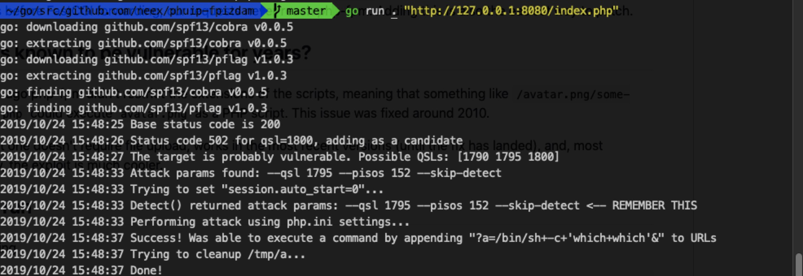

# [漏洞复现] CVE-2019-11043 PHP-FPM RCE

### 漏洞详情
PHP-FPM(PHP FastCGI Process Manager)：PHP FastCGI 进程管理器。php-fastcgi用于解析php请求，php-fpm管理php-fastcgi。

**利用前提**

当 Nginx + PHP-FPM的环境存在以下配置，可导致RCE。

```
location ~ [^/]\.php(/|$) {
  ...
  fastcgi_split_path_info ^(.+?\.php)(/.*)$;
  fastcgi_param PATH_INFO       $fastcgi_path_info;
  fastcgi_pass   php:9000;
  ...
}
```
### 漏洞复现



**参考**

https://github.com/neex/phuip-fpizdam/

https://github.com/vulhub/vulhub/tree/master/php/CVE-2019-11043